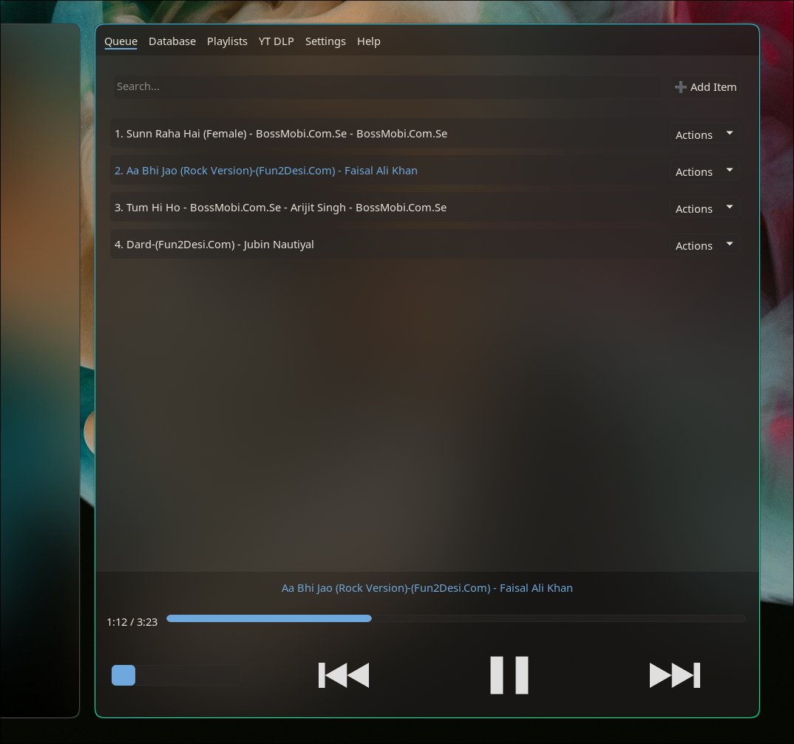
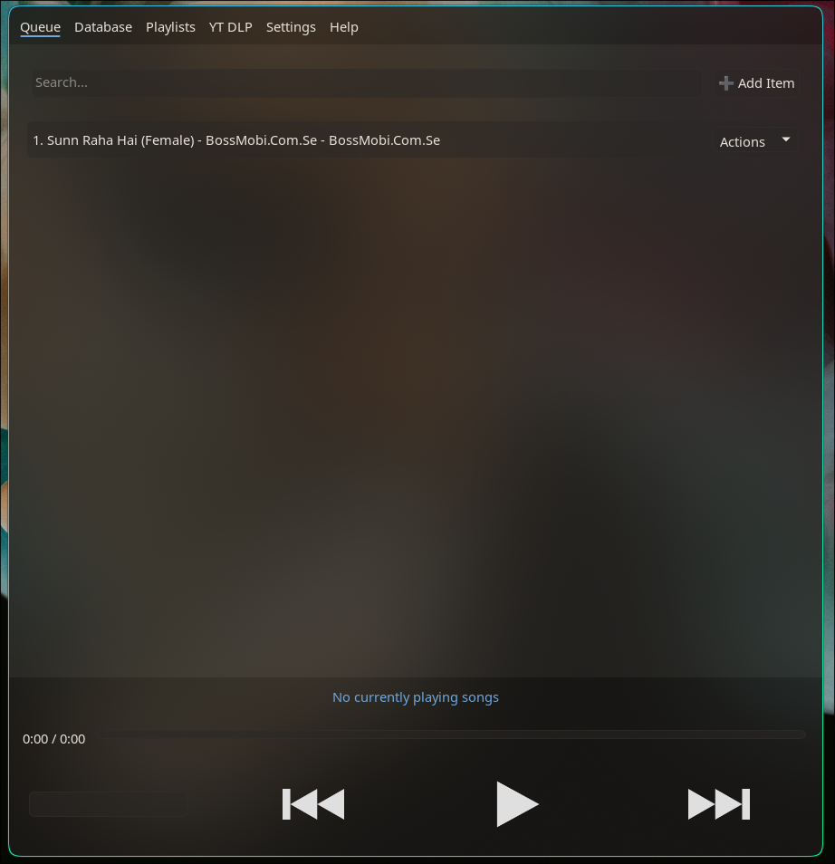
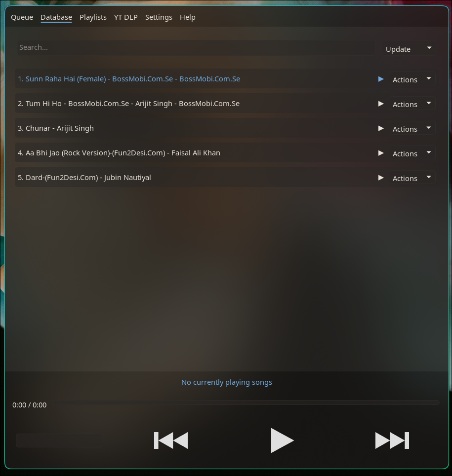
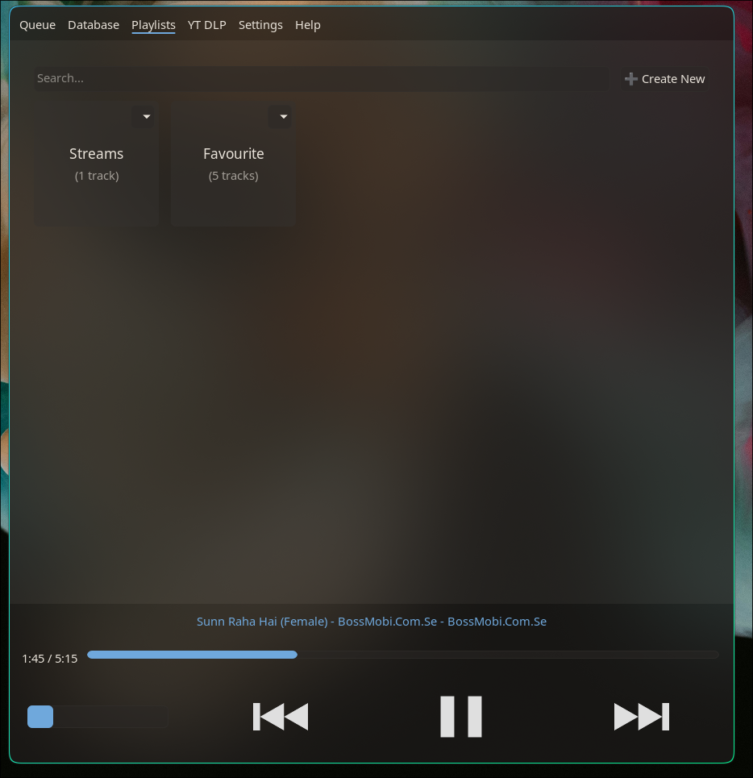
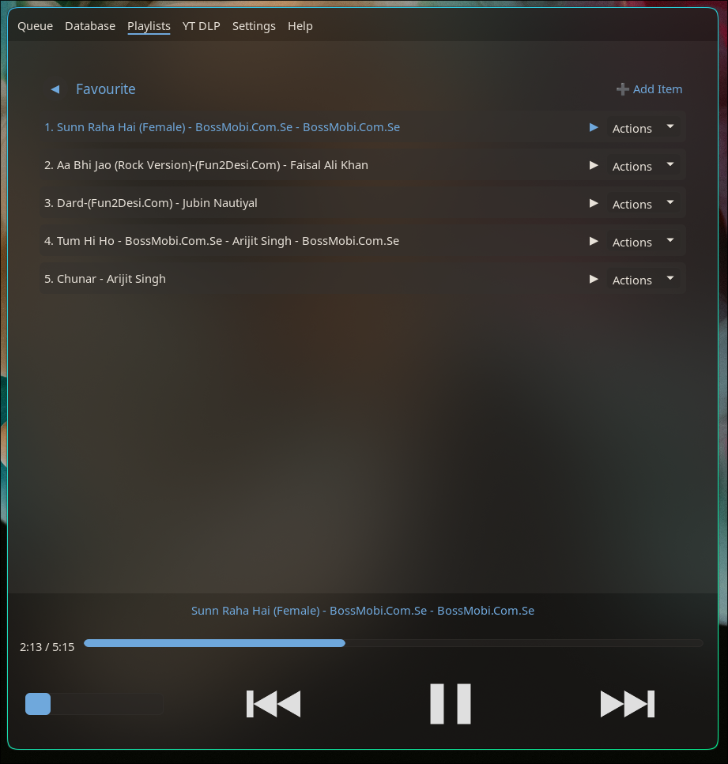
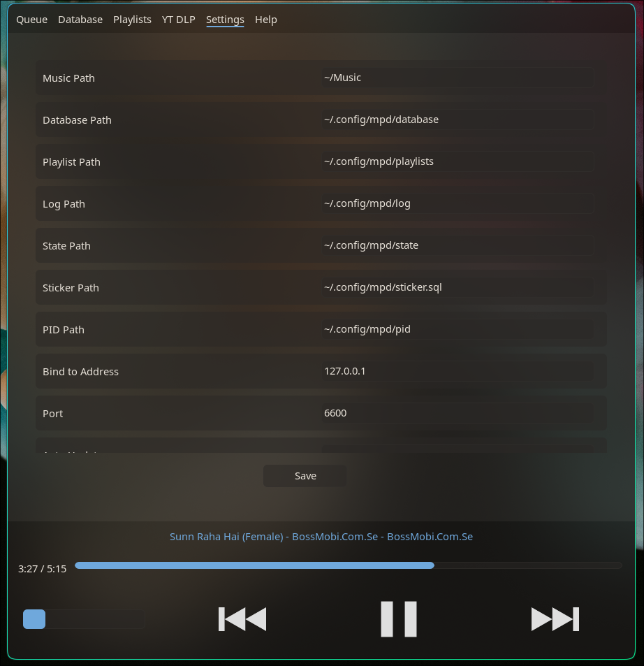

# HyprMusic

A dedicated Hyprland frontend for the Media Player Daemon (MPD) on Linux, built with C++ and the Hyprtoolkit API.

---

## Key Features and Interface

### 1. Queue Tab
* **Current Playback:** Monitor all tracks currently in the MPD playback queue.
* **Track Controls:** Play, pause, remove, or jump directly to any specific track.
* **Search Filter:** Instantly filter the queue by track title, artist, or album.
* **Queue Management:** Seamlessly add items from the queue to a playlist, or remove them entirely.
* **Versatile Additions:** Add items to the queue from various sources, including your database, existing playlists, or direct stream links.

### 2. Database Tab
* **Library Overview:** View all tracks stored in your database. This reflects all files within the music directory specified in your `mpd.conf` file (defaults to `~/Music`).
* **Seamless Integration:** Quickly append any item from the database to your active queue or a saved playlist.
* **Database Rescan:** Trigger database updates or full rescans from the interface.

### 3. Playlists Tab
* **Playlist Management:** Access and view all saved MPD playlists within your library.
* **Creation, Renaming & Deletion:** Generate new empty playlists, rename playlists, or delete existing ones.
* **Track Inspection:** Expand individual playlists to review their contents, move tracks between playlists, and load them into the active playback queue.

### 4. YT-DLP Online Search Tab
* **Online Search:** Search YouTube audio tracks online using `yt-dlp`.
* **Direct Streaming:** Stream YouTube audio directly into MPD or import entire YouTube playlists.
* **Playlist Saving:** Save YouTube stream URLs into local MPD playlists.

### 5. Settings Tab
* **Configuration Access:** View and modify MPD settings (directories, network bind/port, auto-update, PipeWire Pulse audio output, FIFO visualizer) configured within `~/.config/mpd/mpd.conf`.

### 6. Help Tab
* **Built-in Documentation:** Access user guide and feature overview directly in the app.

---

## Playback and Control Bar

* **Persistent Control Bar:** The bottom bar provides quick access to essential track information and controls. It includes the current track title and artist, elapsed and total playback time, an interactive seek bar, a play/pause toggle, previous/next track controls, and a volume slider.
* **Background Execution:** Powered by the MPD backend, audio playback continues uninterrupted in the background even if the graphical user interface is closed.

---

## Screenshots

