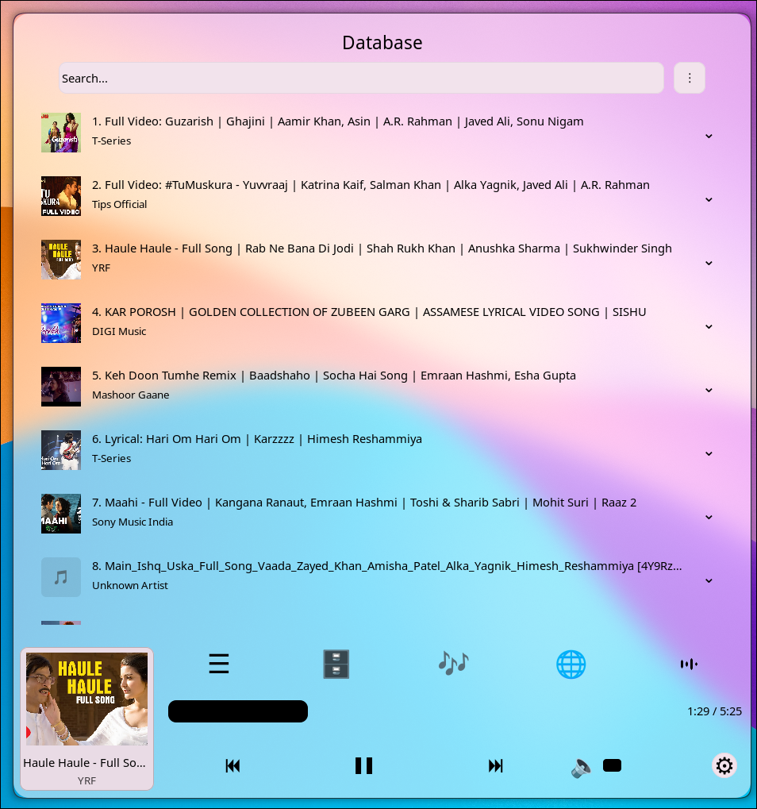
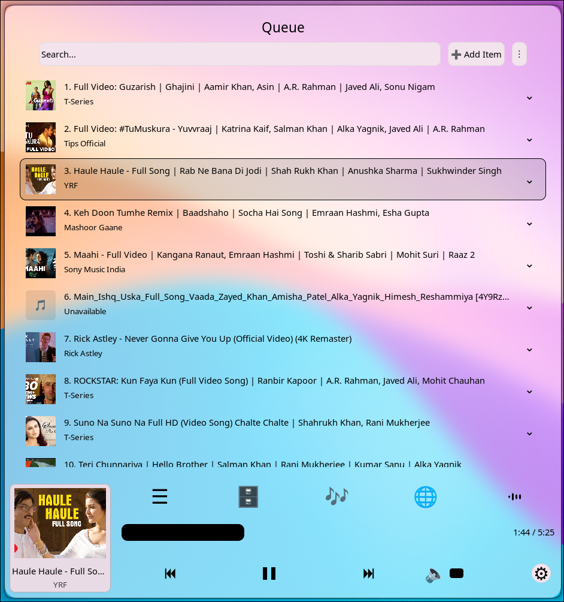
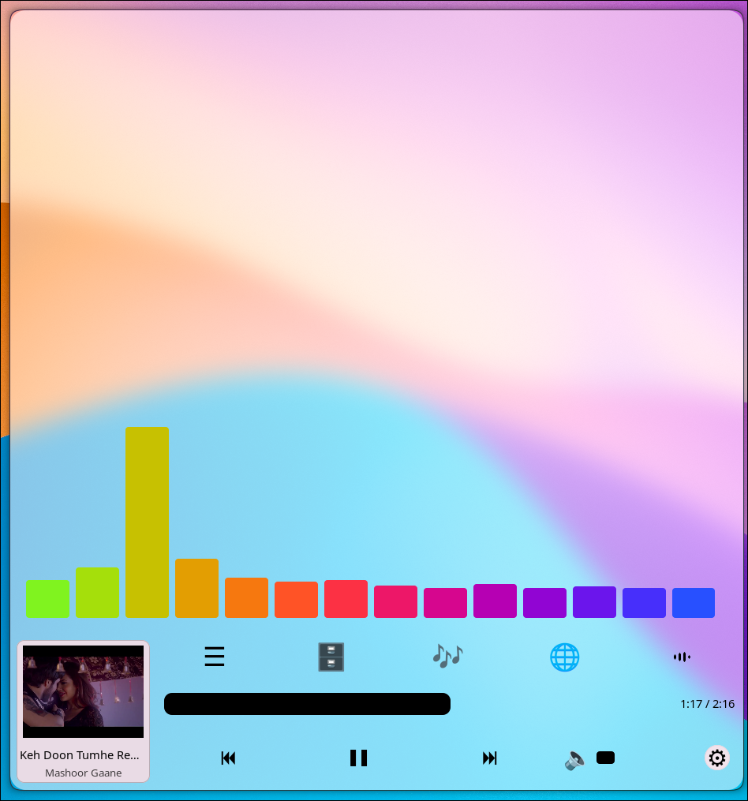
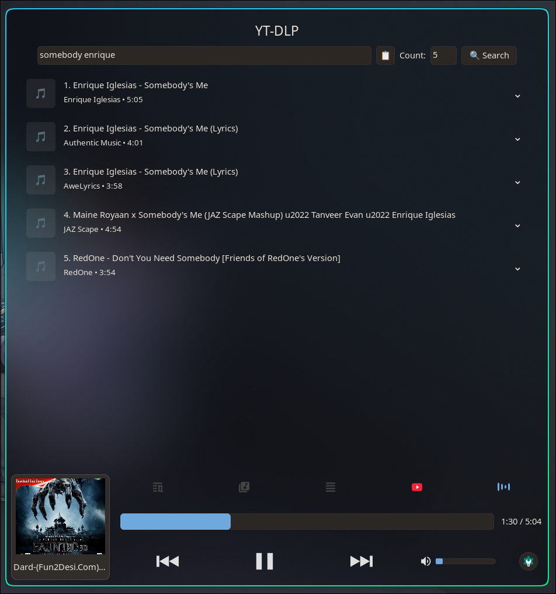
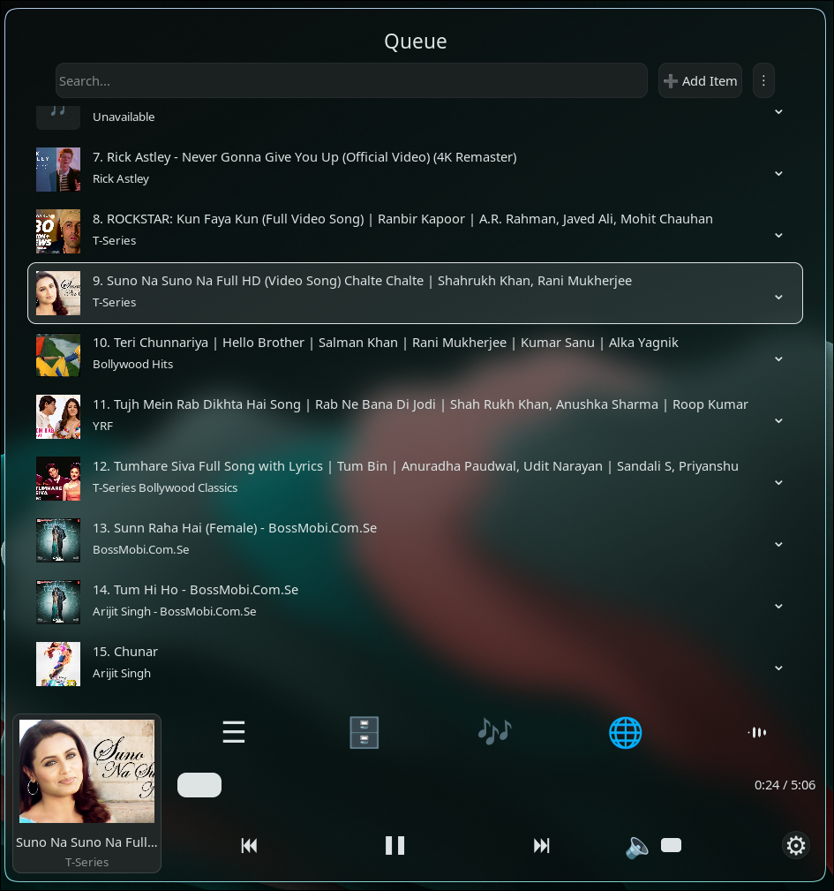
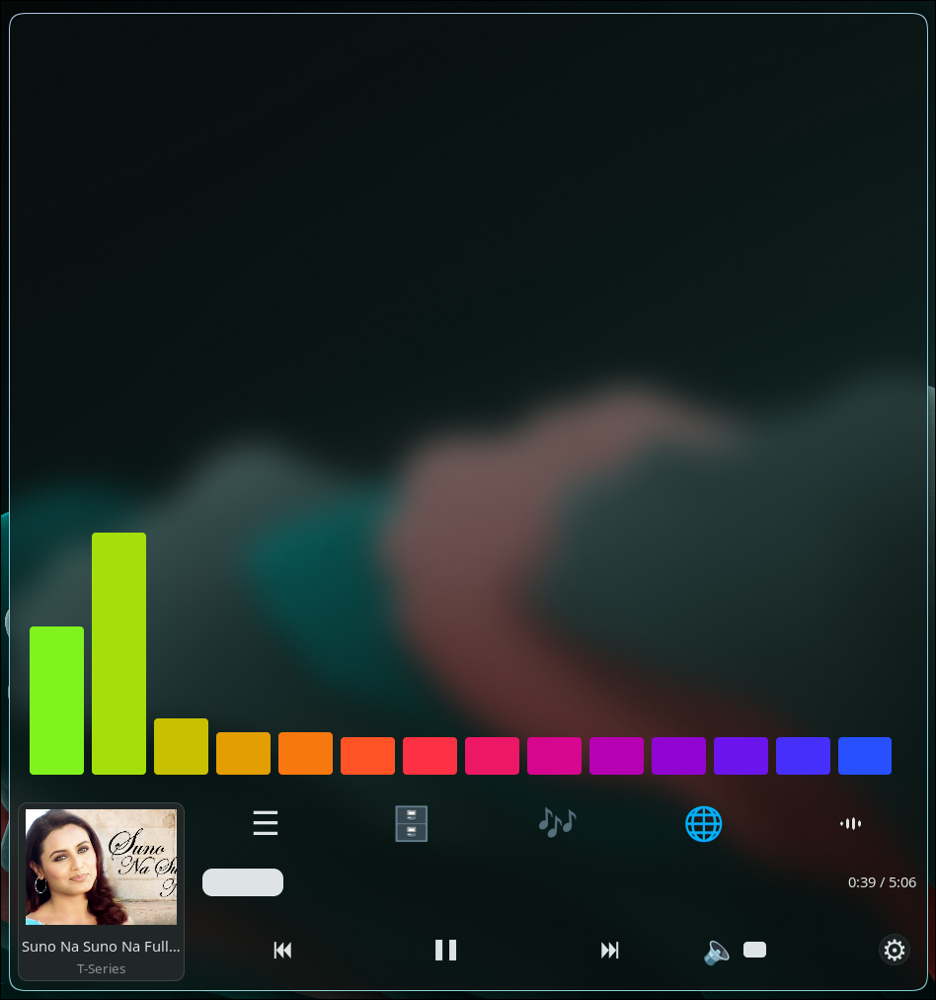
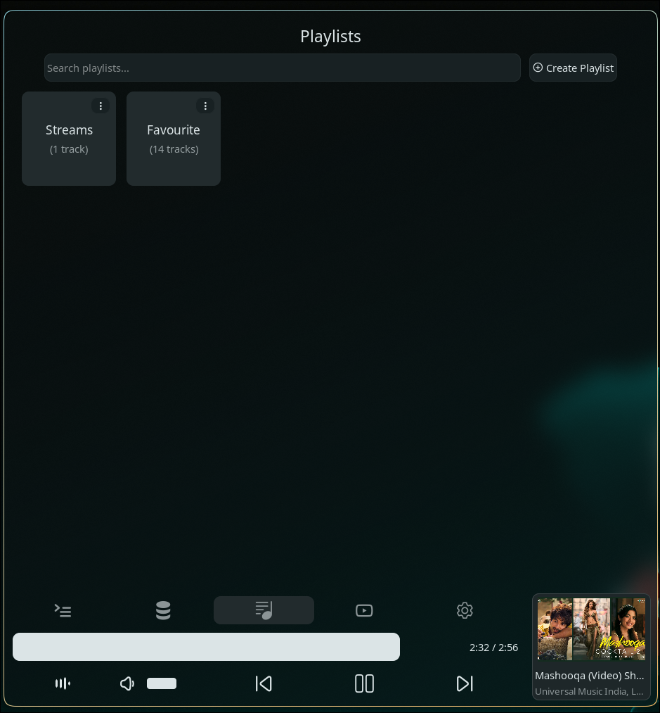

# HlMusic

A dedicated Hyprland frontend for the Media Player Daemon (MPD) on Linux, built with C++ and the Hyprtoolkit API.


## Features
We have Tabs for Player View, Current Queue, Database, Playlists, YT-DLP and Settings.
Bottom contains all the controls along with tab navigation bar.
Songs can easily be moved around from Database to Queue to Playlist to Queue etc.
YT-DLP offers to download to database or direct add to queue and stream.
Visualizers are there. On click switches to next visualizations.
IconPack is embedded into the binary. No need of installation of any icon pack. We made it deliberate.

## File Browser Integration:
The make.sh after installing, automatically updates mime-lists and .desktop file has mime type set. So, once installed, it will automatically be offered as "Open With" option in any File Manager. And we can easily play it from File Browser.

## No duplicate state
Only single state of the player is allowed.

## Theming 
We want consistency and less headache while setting theme, so, like other hypr-ecosystem apps e.g. hyprlauncher, our hlmusic app follows the Hyprtoolkit theme definition. It is defined in the root/system already but user can customise it in ~/.config/hypr/hyprtoolkit.conf. Have a look at "https://wiki.hypr.land/Hypr-Ecosystem/hyprtoolkit/" in the Configuration section. We have utilised almost all of the definitions there. So, if you define background color there, same background color will be used in hlmusic. Only thing we did not use is the IconPack because we wanted signature look and guarantee the icons to render theme specific colors. Moreover, we wanted our own icon set hence we created a font pack(actually it is icon pack) and embedded inside the app. 
TL-DR: It inherits ~/.config/hypr/hyprtoolkit.conf definitions of color/font/etc. Except icon pack. If not defined, it uses system predefined hyprtoolkit.conf.

**Interested in the look of the screenshots attached?**
It was obtained by setting the background color to 50% transparent color in hyprtoolkit.conf and blur definition is in hyprland.conf.

## Important
It is an MPD front-end hence it will do nothing if MPD is not installed.

## Installation

```bash
git clone https://github.com/anisursamsung/hlmusic.git
cd hlmusic

# User-space install (recommended, installs to ~/.local without root):
./make.sh

# Or system-wide install (all users):
sudo ./make.sh /usr/local
```

`./make.sh` automatically configures CMake, builds with `--parallel`, and installs:
- **Binary**: `<prefix>/bin/hlmusic` (`~/.local/bin/hlmusic` by default)
- **Desktop Entry**: `<prefix>/share/applications/hlmusic.desktop`
- Refreshes desktop MIME databases so `hlmusic` appears in your application launchers, Rofi, and file manager "Open With" menus.

Ensure `~/.local/bin` is in your `$PATH`.

## Screenshots







